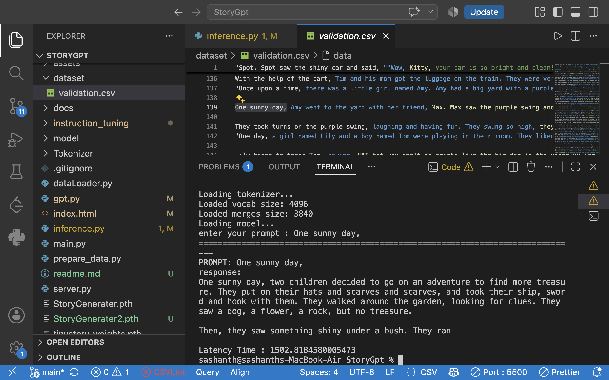
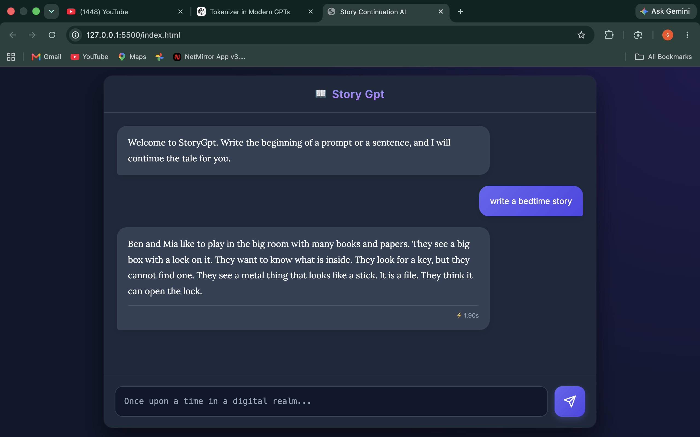

# StoryGPT

<div align="center">

# StoryGPT

### A Decoder-Only GPT Language Model Built from Scratch using PyTorch

StoryGPT is an educational implementation of a **Generative Pre-trained Transformer (GPT)** designed to understand modern Large Language Models from **first principles**.

Instead of relying on high-level frameworks, this project rebuilds the complete language model training pipeline—from a custom tokenizer to autoregressive inference—while documenting every stage of the process.

The model is trained on the **TinyStories** dataset and is capable of generating coherent children's stories, completing story prompts, and following natural language instructions after instruction tuning.

**Model Size:** **5.32 Million Parameters**

</div>

---

## Why StoryGPT?

Large Language Models often feel like a black box.

The goal of StoryGPT was to understand **every component** that makes modern GPT models work by implementing each stage independently instead of treating PyTorch or HuggingFace as magic.

This project focuses on developing intuition behind

- Tokenization
- Embedding Layers
- Positional Embeddings
- Multi-Head Self Attention
- Feed Forward Networks
- Residual Connections
- Layer Normalization
- Training using Backpropagation
- Autoregressive Generation
- Instruction Fine-Tuning

Every module is documented individually inside the `/Docs` directory.

---

# Features

- Custom BPE Tokenizer
- High-performance C++ tokenizer inference
- Binary dataset preprocessing pipeline
- Memory-mapped dataset loading
- Custom autoregressive DataLoader
- Token Embedding
- Learnable Positional Embedding
- Multi-Head Causal Self Attention
- Feed Forward Network (GELU)
- Layer Normalization
- Decoder-only GPT Architecture
- Temperature Sampling
- Top-K Sampling
- Instruction Fine-Tuning

---

# Model Configuration

| Hyperparameter      |            Value |
| ------------------- | ---------------: |
| Architecture        | Decoder-only GPT |
| Parameters          | **5.32 Million** |
| Vocabulary Size     |             4097 |
| Context Length      |              256 |
| Embedding Dimension |              256 |
| Attention Heads     |                8 |
| Transformer Blocks  |                4 |
| Hidden Dimension    |             1024 |
| Dropout             |              0.1 |
| Optimizer           |            AdamW |
| Learning Rate       |             3e-4 |

---

# Project Architecture

<a href="assets/architecture.png">
    
</a>

# Repository Structure

```
StoryGPT/

├── Tokenizer/
│   ├── /v1 #python implementaion
│   └── /v2 # cpp Implementation
│
├── Model/
│   ├── embedding.py #Embedding Layer
│   ├── attention.py #attention Layer
│   ├── hidden.py #Feed Forward  Neural Network
│   ├──output.py  Output Projection
│
├── Dataset/
│
├── Docs/
│
├── instruction_tuning/
│   ├── Dataset
│   └── Fine-Tuned Models
│
|── gpt.py #assembeled all the layers
├── TrainingGpt.py #training the gpt with data
├── Inference.py #run the model
│
├── tinyStories.pth
├── tinyStories2.pth
├── tinyStories3.pth
│
|── StoryGenerater.pth #instruction tuned model
|── StoryGenerater.pth #instruction tuned model using instruction_dataset2.json
└── README.md
```

---

# Training Pipeline

StoryGPT was trained progressively across multiple training stages.

| Training Stage |       Loss |
| -------------- | ---------: |
| Initial        |     8.1754 |
| Stage 1        |     3.5014 |
| Stage 2        |     2.5713 |
| Final          | **2.2503** |

The model was later instruction tuned to improve prompt following.

---

# Tokenizer Benchmark

Custom tokenizer benchmark

| Metric           |        Value |
| ---------------- | -----------: |
| Vocabulary Size  |         4097 |
| Merge Operations |         3840 |
| Characters       |       16,500 |
| Tokens           |        3,700 |
| Encode Time      | **6.643 ms** |
| Decode Time      | **0.843 ms** |

The tokenizer also includes a **C++ implementation** for high-performance inference.

Its merge algorithm was optimized using efficient data structures and lazy update techniques to significantly reduce preprocessing latency during inference.

---

# Inference Benchmark

Device

```
Apple MacBook Air M1 (MPS)
```

Average Story Generation Latency

```
697.14 ms
```

---

# Example Generations

### Prompt

```
Ben found
```

### Generated Story

```
Ben found the toy. He was very happy and he hugged the toy.

"Thank you, Mom!" Ben said.
"You are the best!"

They went back to their room, happy mom and dad.
They had a good day in the kitchen.
```

Generation Time

```
575.79 ms
```

---

### Prompt

```
A pirate found
```

### Generated Story

```
A pirate found the island.

He was very happy and wanted to come out and play with him.

He pulled out a big rope,
opened the lock,
opened it again,
and jumped into the boat.

He smiled happily as the island welcomed him.
```

Generation Time

```
771.18 ms
```

---

# Terminal Output

<a href="assets/Sample3.png">
    
</a>

# UI Based ouptut

<a href="assets/Sample1.png">
    
</a>

### ⏱️ Latency Note

- **Total Latency:** Includes model loading and server initialization.
- **Subsequent Calls:** Faster after the initial cold start.

# Documentation

Every major component is explained separately inside the `Docs` directory.

- [Tokenizer](docs/tokenizer.md)
- [Dataset Preparation](docs/dataset_preparation.md)
- [DataLoader](docs/dataloader.md)
- [Embedding Layer](docs/embedding_layer.md)
- [Positional Embeddings](docs/positional_embeddings.md)
- [Self Attention](docs/self_attention.md)
- [Feed Forward Networks](docs/feed_forward_networks.md)
- [Transformer Block](docs/transformer_block.md)
- [Training Pipeline](docs/training_pipeline.md)
- [Backpropagation](docs/backpropagation.md)
- [Inference](docs/inference.md)
- [Instruction Fine-Tuning](docs/instruction_fine_tuning.md)

The documentation focuses on intuition, mathematical understanding, tensor dimensions, and implementation details.

---

# Running the Model

Clone the repository

```bash
git clone https://github.com/sashanth17/StoryGpt
```

Install dependencies

```bash
pip install torch numpy
```

Run inference

```bash
python inference.py
```

---

# Future Work

The long-term goal of StoryGPT is to evolve beyond story generation into a general-purpose autoregressive language model.

Planned improvements include

- Flash Attention
- KV Cache
- Mixed Precision Training
- Better Sampling Strategies
- Distributed Training
- HuggingFace Release

# Motivation

StoryGPT began as a personal challenge to understand how modern Large Language Models actually work—not by reading abstractions, but by implementing every major component from scratch.

The project represents a journey through tokenization, attention mechanisms, transformer architectures, optimization, and autoregressive generation, with the goal of building strong intuition from first principles while exploring opportunities for systems optimization along the way.

---

## This project draws heavy inspiration and data from the following foundational works in the field:

- **[Attention Is All You Need (Vaswani et al., 2017)](https://arxiv.org/abs/1706.03762)** - The foundational paper that introduced the Transformer architecture used in this project.
- **[TinyStories Dataset (Eldan & Li, 2023)](https://arxiv.org/abs/2305.07759)** - The dataset used to pre-train the model, demonstrating that small language models can learn fluent grammar and coherent story structures.
- PyTorch & the open-source LLM research community.

---

⭐ If you found this project interesting, consider giving it a star!
